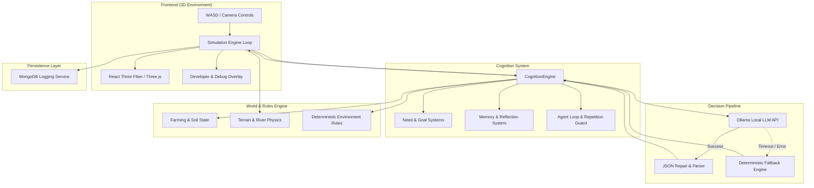

# Civigensis 🌾🤖

> **An Embodied 3D Autonomous AI Citizen Village Powered by React Three Fiber & Local LLMs**

Civigensis is a real-time 3D multi-agent virtual environment featuring autonomous AI citizens (Ben, Julie) and NPCs (Ravi) residing in **Willowbrook Village**. Built on React 18, Three.js, TypeScript, Vite, and Ollama, Civigensis bridges spatial 3D physics with cognitive AI architectures—enabling agents to farm, trade, converse, reflect, and navigate a living, reactive environment.

---

## 🌟 Key Features

### 🌍 1. Embodied 3D Simulation & Physics Engine
* **Interactive 3D Environment**: Built using `@react-three/fiber` and `@react-three/drei`.
* **Dynamic Physics & Terrain Snapping**: Real-time ground physics (`GroundPhysics.ts`), heightmap sampling, slope angle calculations, bridge deck height snapping, steep cliff obstruction, and river swimming physics.
* **Environmental Weather Cycle**: Simulates time of day, sunlight intensity, rain events (`RainSystem.tsx`), cloud coverage (`CloudSystem.tsx`), soil moisture evaporation, and temperature changes (`AllRules.ts`).
* **Skeletal Animation System**: Custom 3D avatar animations supporting states such as `IDLE`, `WALK`, `RUN`, `SWIM`, `TREAD_WATER`, `WATER_CROP`, `HARVEST_CROP`, `PLANT_CROP`, and social gestures.

### 🧠 2. Autonomous Cognition Architecture
* **Local LLM Integration**: Powered by `OllamaService.ts`, interfacing directly with local models (`deepseek-r1:7b`, `qwen2.5`, `llama3`, `mistral`) running via Ollama.
* **JSON Self-Healing Pipeline**: Auto-corrects malformed LLM outputs into strictly typed `StructuredDecision` objects.
* **Multi-Tiered Memory System**: Integrates episodic memory (`MemorySystem.ts`), long-term memory retrieval, dynamic memory indexing, and reflection routines (`ReflectionSystem.ts`).
* **Physiological Needs & Goal Stacks**: Tracks continuous agent needs (hunger, energy, thirst, social fulfillment) driving dynamic goal stack prioritization (`GoalSystem.ts`, `NeedSystem.ts`).
* **Guards & Safety Resolvers**: Includes repetition guards (`AgentLoopGuard.ts`), location target resolvers (`TargetResolver.ts`), and action validators (`ActionValidator.ts`).
* **Deterministic Fallback State Machine**: Provides a smooth fail-safe priority engine (`generateFallbackDecision`) ensuring continuous agent behavior even when LLM endpoints are unreachable or timing out.

### 🌾 3. Farming Engine, Economy & Social Dynamics
* **Crop & Soil Hydration**: Interactive wheat fields where agents monitor soil moisture, collect water from the river, irrigate soil, plant seeds, and harvest mature crops.
* **Village Economy**: Credit currency tracking and trade interactions with village shopkeeper NPCs like Ravi.
* **Social Perception & Dialogue**: Spatial overhearing radii, proximity-based social greetings, relationship state tracking (`RelationshipSystem.ts`), emotion modeling (`EmotionSystem.ts`), and conflict resolution (`ConflictSystem.ts`).

### 🛠️ 4. Interactive Developer Suite & Telemetry
* **Citizen Debug Panels**: Real-time HUD (`CitizenDebugPanel.tsx`) showing agent internal thoughts, decision reasoning, active memory logs, physiological need bars, and target coordinates.
* **Map & World Editor**: Built-in visual map editor modal (`MapEditorModal.tsx`) for inspecting and modifying sector grid cells.
* **Live Telemetry & Navigation Debugger**: Overlays real-time slope angles, ground height, foot delta, walkable flags, and grid coordinates (`NavigationDebugOverlay.tsx`).
* **MongoDB Event Persistence**: Optional persistent logging server (`MongoDBService.ts`, `mongoMiddleware.ts`) tracking every agent decision, speech event, and memory operation.

---

## 🏗️ System Architecture



---

## 📁 Directory Structure

```
civigensis/
├── docs/                        # Architectural specifications & comparisons
│   ├── ARCHITECTURE.md          # 3-Layer System Architecture
│   ├── ECONOMY.md               # Credit & Victory Arch Pitch System
│   ├── EMERGENCE_VS_CIVIGENSIS.md # Benchmark & Autonomy Comparison
│   ├── GOVERNANCE.md            # Living Constitution & Proposal Engine
│   ├── MEMORY.md                # Multi-Tiered Memory Architecture
│   └── ORCHESTRATION.md         # Simulation Engine & Turn Loop Specs
├── scripts/                     # Developer tooling & test scripts
│   ├── generate-doc.js          # Codebase documentation generator
│   ├── scan-animations.js       # GLTF animation scanner utility
│   ├── test-agent-architecture.js # Offline agent pipeline test runner
│   └── test-mongodb-logging.js  # MongoDB database test suite
├── src/
│   ├── components/
│   │   ├── camera/              # Camera controllers & follow modes
│   │   ├── characters/          # 3D Citizen models & skeletal mesh loaders
│   │   ├── ui/                  # Debug panels, map editor & overlays
│   │   └── world/               # R3F terrain, water, weather, and building meshes
│   ├── config/                  # Citizen profiles, identities & model configs
│   ├── server/                  # Express middleware for MongoDB API
│   ├── services/                # Database connections (MongoDB)
│   ├── systems/
│   │   ├── ai/                  # Cognition, Ollama, Memory, Needs, Goals, Social AI
│   │   ├── animation/           # Animation state machines
│   │   ├── logging/             # Agent event logging
│   │   ├── navigation/          # Grid world map & pathfinding
│   │   ├── npc/                 # Ravi NPC FSM brain
│   │   ├── physics/             # Ground height raycasting & slope physics
│   │   └── simulation/          # World clock tick & weather rule engines
│   └── types/                   # TypeScript interfaces (Citizen, Memory, AI, Map)
├── ANIMATION_MEMORY.md          # 3D Animation track catalog & developer notes
├── package.json                 # Project dependencies & scripts
├── tsconfig.json                # TypeScript configuration
└── vite.config.ts               # Vite configuration
```

---

## 🚀 Getting Started

### Prerequisites

* **Node.js**: `v18.0.0` or higher
* **npm**: `v9.0.0` or higher
* **Ollama** (Recommended for local LLM autonomy): [Download Ollama](https://ollama.com/)
* **MongoDB** (Optional, for persistent event logging): Local instance on `mongodb://localhost:27017`

### 1. Installation

Clone the repository and install npm dependencies:

```bash
git clone https://github.com/AkashdeepG-FOC/civigensis.git
cd civigensis
npm install
```

### 2. Setting Up Ollama (Local AI Agents)

Ensure Ollama is installed and running on your machine:

```bash
# Pull the recommended default local model
ollama pull deepseek-r1:7b

# Alternatively pull qwen2.5 or llama3
ollama pull qwen2.5:7b
ollama pull llama3:8b
```

Ollama will run on its default endpoint: `http://localhost:11434`.

### 3. Launching the Application

Start the local development server:

```bash
npm run dev
```

Open your browser and navigate to `http://localhost:5173`.

---

## 🎮 Controls & Hotkeys

### Manual Character Controls
When a citizen's AI mode is toggled off in the Debug Panel, you can manually control their movement:
* **`W` / `Up Arrow`**: Walk Forward
* **`S` / `Down Arrow`**: Walk Backward
* **`A` / `Left Arrow`**: Strafe Left
* **`D` / `Right Arrow`**: Strafe Right
* **`Shift` + Movement**: Run / Fast Swim

### Developer Hotkeys for Animation Testing
* **`1`**: Force `IDLE` state
* **`2`**: Force `WALK` state
* **`3`**: Force `RUN` state
* **`4`**: Force `SWIM` state
* **`5`**: Force `TREAD_WATER` state
* **`6`**: Force `WATER_CROP` animation
* **`7`**: Force `HARVEST_CROP` animation
* **`8`**: Force `PLANT_CROP` animation

---

## 📜 NPM Scripts & Utilities

| Command | Description |
| :--- | :--- |
| `npm run dev` | Starts Vite local development server with hot module replacement |
| `npm run build` | Runs TypeScript compiler (`tsc`) and builds production web assets |
| `npm run preview` | Previews production build locally |
| `npm run scan-animations` | Runs GLTF animation scanner script (`scripts/scan-animations.js`) |
| `node scripts/test-mongodb-logging.js` | Executes MongoDB event logger integration test |
| `node scripts/test-agent-architecture.js` | Tests citizen cognitive loop and tool execution offline |

---

## 📚 Technical Documentation

Explore the detailed architecture specifications in the [`docs/`](file:///d:/new_git/civigensis/docs) folder:

* 📄 [Architecture Specification](file:///d:/new_git/civigensis/docs/ARCHITECTURE.md) — 3-Layer architecture breakdown.
* 📊 [Emergence World vs. Civigensis](file:///d:/new_git/civigensis/docs/EMERGENCE_VS_CIVIGENSIS.md) — Comparative analysis on model autonomy, tool registries, and rule systems.
* 🧠 [Memory Systems](file:///d:/new_git/civigensis/docs/MEMORY.md) — Deep dive into Soul entries, episodic memory, and memory compression.
* 💰 [Economy Systems](file:///d:/new_git/civigensis/docs/ECONOMY.md) — ComputeCredits (CC) and victory arch pitch mechanics.
* ⚖️ [Governance & Constitution](file:///d:/new_git/civigensis/docs/GOVERNANCE.md) — Voting thresholds and constitutional article proposals.
* 🔄 [Orchestration](file:///d:/new_git/civigensis/docs/ORCHESTRATION.md) — Round-robin simulation turn loop specs.

---

## 🤝 Contributing

Contributions are welcome! If you would like to add new tools, expand village terrain, or introduce new agent behaviors:

1. Fork the Repository
2. Create a Feature Branch (`git checkout -b feature/AmazingFeature`)
3. Commit your changes (`git commit -m 'Add some AmazingFeature'`)
4. Push to the Branch (`git checkout -b feature/AmazingFeature`)
5. Open a Pull Request

---

## 📄 License

Distributed under the MIT License. See `LICENSE` for more details.
